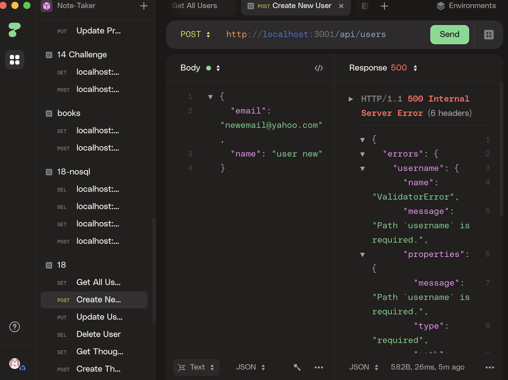

# Social NetWork API

## Description 
This is a backend application for a social networking app. This allows for user to create thoughts and have reactions. 

## Usage 
Used express, mongodb and npm i and use httpie to start that local host 

## ScreenShot 

## Video Link

[VIDEO LINK](assets/sna.mp4)